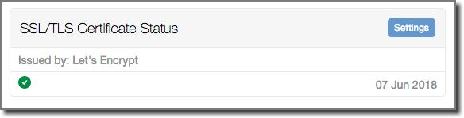

# Perch SSL/TLS Certificate Status Dashboard Widget

A Perch dashboard widget that shows when the installed SSL/TLS certificate will expire. 

It was created to give a headline indication that short duration certificates, like those from [Let's Encrypt](https://letsencrypt.org/), are being actiively being renewed.

Application name: impeng_certdash

## Installation

copy the `impeng_certdash` folder from inside the downloaded folder into the folder `perch/addons/apps/`.
No other actions are needed.

## Configuration

With more than 28 days remaining befor the certificate expiry the indicator will be green.

The indicator changes to the standard Perch warning symbol when the certificate is within 28 days of expiry. 

It then changes to the Perch alert symbol when the certificate is within 14 days of expiry. 

The number of days for each warning level can be altered on the settings page which can be also be accessed using the link in the widgets heading bar.

## Limitations

The widget does not make any attempt (as yet) to validate that the current domain is covered by the certificate (Common Name or Alternative Names).

It is designed to be used when certificates are already installed, tested and working. 

## Troubleshooting

If your certificate is not valid or your server is not responding to https on port 443 the widget will look like this:

The app has been tested with Let's Encrypt certificates on several domains. If it's not working with your certificate let us know. But please ensure you have a valid certificate first. A good SSL checker can be found at [SSL Labs](https://www.ssllabs.com/ssltest/).

