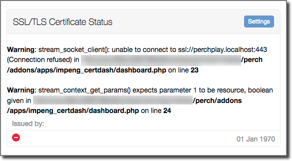

# Perch SSL/TLS Certificate Status Dashboard Widget

A Perch dashboard widget that shows when the SSL/TLS certificate will expire. 

It was created to give a headline indication that short duration certificates, like those from [Let's Encrypt](https://letsencrypt.org/), are being actiively being renewed.

Application name: impeng_certdash

## Installation

copy the impeng_certdash folder from inside the downloaded folder into the folder perch/addons/apps/
No other actions are needed.

## Configuration

With more than 28 days remaining befor the certificate expiry the indicator will be green.

The indicator changes to the standard Perch Warning symbol when the certificate is within 28 days of expiry. 

It then changes to the Perch Alert symbol when the certificate is within 21 days of expiry. 

These figures can be altered in the first few lines of of the file /impeng_certdash/dashboard.php

## Warning

The widget does not make any attempt (as yet) to validate that the current domain is covered by the certificate (Common Name or Alternative Names).

It is designed to be used when certificates are installed and working and will then give a indication if certificates are about to expire.

## Troubleshooting

If your certificate is not valid the widget will look like this:

The app has been tested with Let's Encrypt certificates on several domains. If it's not working with your certificate let us know. But please ensure you have a valid cert first. I use the SSL checker at [SSLShopper](https://www.sslshopper.com/ssl-checker.html).

